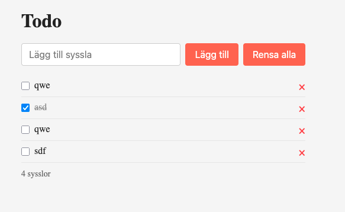

# Exercises

## Exercise 02-todo-refactored-functions
Starting from `01-todo-basic`, refactor `main.js` so that data logic and DOM handling are separated into distinct functions — but still in the same file.

### a)
- Extract the data logic into separate functions: `addTodo(text)`, `removeTodo(id)`, `getTodoCount()`, `resetTodos()`
- These functions should only work with the `todos` array — no `document` or DOM references
- Mark the section with a comment: `// --- Data-logik (ingen DOM) ---`

### b)
- Extract the DOM handling into separate functions: `addTodoElement(todo, onRemove)`, `updateStats(count)`
- `addTodoElement` should take a `todo` object and an `onRemove` callback as parameters
- `updateStats` should take a count and update the stats text
- Mark the section with a comment: `// --- DOM-hantering ---`

### c)
- Rewrite the event listeners to use the functions from a) and b)
- The submit handler should call `addTodo`, then `addTodoElement`, then `updateStats`
- The clear button handler should call `resetTodos`, clear the list, and call `updateStats`
- Mark the section with a comment: `// --- App (kopplar ihop data och DOM) ---`

## Exercise 03-todo-modular
Starting from `02-todo-refactored-functions`, split the code into separate files using ES modules (`import`/`export`).

### a)
- Move the data logic functions into `src/todo-model.js`
- Add `export` in front of each function
- The `todos` array and `nextId` variable stay in `todo-model.js` (they are private to the module)

### b)
- Move the DOM handling functions into `src/todo-view.js`
- Add `export` in front of each function
- Add a `clearList()` function that clears the todo list

### c)
- Update `src/main.js` to import from `todo-model.js` and `todo-view.js`
- Example: `import { addTodo, removeTodo, getTodoCount, resetTodos } from "./todo-model.js";`
- The event listeners stay in `main.js`

### d)
- Update `index.html` to load `main.js` as a module
- Replace the three ``

## Exercise 04-todo-tests
Starting from `03-todo-modular`, set up a test environment and write unit and integration tests.

### a) Setup
- Run `npm init -y` to create a `package.json`
- Run `npm install -D vitest jsdom eslint` to install dev dependencies
- Create `vitest.config.js` in the project root (see instructions.md for configuration)
- Run `npx eslint --init` to configure ESLint
- Add `"test": "vitest run"` and `"lint": "eslint src/"` to the `scripts` section in `package.json`

### b) Unit tests
- Create `tests/unit/todo-model.test.js`
- Import `describe`, `test`, `expect`, `beforeEach` from `vitest`
- Import the functions from `todo-model.js`
- Use `beforeEach` with `resetTodos()` to clear state between tests
- Write the following tests:
  - `addTodo` returns a todo with correct id, text, and done:false
  - `addTodo` trims whitespace from the text
  - `addTodo` returns null for empty string
  - `removeTodo` removes the correct todo
  - `getTodoCount` returns the correct count after adding/removing
  - `resetTodos` clears all todos

### c) Integration tests
- Create `tests/integration/app.test.js`
- Import functions from both `todo-model.js` and `todo-view.js`
- In `beforeEach`, call `resetTodos()` and set up a fresh DOM with `document.body.innerHTML`
- Write the following tests:
  - Adding a todo shows it in the list
  - Clicking the remove button removes the todo from the list and from the data
  - Clearing removes all todos from both the list and the data

### d) Run and verify
- Run `npm test` — all tests should pass
- Run `npm run lint` — no errors should be reported

## Exercise 05-toggle-done
Building on `04-todo-tests`, add a new feature: a checkbox that toggles a todo as done/undone. Then write tests for the new feature.

### a) Data logic
- Add a `toggleTodo(id)` function in `todo-model.js` that flips the `done` property of a todo
- The function should find the todo by id and set `done` to `!done`
- Export the function

### b) DOM
- Update `addTodoElement` in `todo-view.js` to include a checkbox (`<input type="checkbox">`) before the text
- When the checkbox is clicked, it should call a callback (similar to how `onRemove` works)
- When a todo is done, add the CSS class `done` to the `<li>` element
- The existing CSS already handles the styling: `.todo-item.done .todo-text` applies line-through

### c) Wire it up
- Update `main.js` to import `toggleTodo` and pass it as a callback when creating the todo element

### d) Unit tests
- Add the following tests to `todo-model.test.js`:
  - `toggleTodo` sets done to true
  - `toggleTodo` on the same todo again sets done back to false
  - `toggleTodo` with an invalid id does nothing

### e) Integration tests
- Add the following test to `app.test.js`:
  - Clicking the checkbox toggles the `done` class on the list item

### f) Run and verify
- Run `npm test` — all tests (old and new) should pass
- Run `npm run lint` — no errors should be reported
