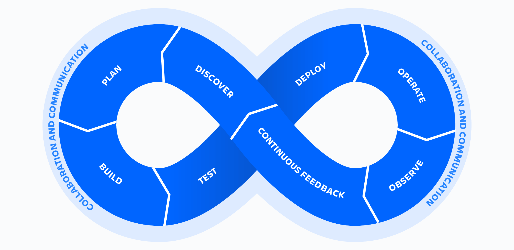

# Getting Started: CI/CD with GitHub Actions + Vercel

## 1. Introduction

**CI (Continuous Integration)** means every code change is automatically built and tested before it can be merged. If a test fails, the team knows immediately — before bad code reaches production.

**CD** stands for two related but distinct practices:

- **Continuous Delivery** means every successful build is automatically prepared and verified so it *could* be deployed to production at any time — but a human still approves the final release. The code is always in a deployable state; the trigger is manual.
- **Continuous Deployment** goes one step further: every successful merge to `main` is automatically deployed to production with no manual steps and no "remember to deploy" moments.

**Example from this project:**

The PR flow is an example of Continuous Delivery in action. When you open a PR against `main`, GitHub Actions automatically runs lint and tests. The branch ruleset blocks the merge button until both `lint-and-tests (22)` and `lint-and-tests (24)` are green — meaning the code is verified and in a deployable state. A human then reviews the PR and decides to merge. That manual merge is the delivery decision.

Once the merge happens, Vercel takes over and deploys automatically — that part is Continuous Deployment.

So the two practices layer on top of each other in this workflow:
1. CI verifies the code is safe to ship (GitHub Actions)
2. Continuous Delivery: a human approves and merges the PR
3. Continuous Deployment: Vercel ships it to production immediately after



The infinity loop above shows the full DevOps cycle. The loop flows continuously: **Discover → Plan → Build → Test → Deploy → Operate → Observe → Continuous Feedback → Discover → ...**

- **Discover** is the starting point of the left loop — insights from the previous cycle (Continuous Feedback) are synthesised into what to work on next
- **Plan → Build → Test** maps to what happens inside a PR in this project: you plan the change, GitHub Actions builds and tests it, and only verified code can be merged
- **Deploy → Operate → Observe** maps to what happens after the merge: Vercel deploys, the app runs in production, and behaviour is observed
- **Continuous Feedback** closes the loop — issues and learnings from production feed back into the next Discover phase

This guide covers:
- **GitHub Actions** for CI — runs lint and tests on every push and PR
- **Vercel** for CD — deploys to production on every merge, and creates preview deployments for every PR

---

## 2. CI with GitHub Actions

### 2a. Creating a workflow via the GitHub UI

1. Go to your repository on GitHub
2. Click the **Actions** tab and add a **New Workflow** 
3. Click appropiate template, in this case teh template **Node.js**, in the **Continuous integration** section
4. GitHub creates `.github/workflows/` in your repo and opens a web editor with a starter file
5. Write or paste your workflow YAML, then click **Commit changes**
6. The workflow runs automatically on the next matching event (e.g. a push)

The workflow file lives in your repository like any other file — you can also create or edit it locally and push it.

---

### 2b. Example on a fully function workflow `.github/workflows/ci.yml`

Here is the full file, explained line by line:

```yaml
name: CI
```
The display name shown in the GitHub Actions tab. This is cosmetic — it has no effect on how the workflow runs.

```yaml
on:
  push:
    branches: [ "main" ]
  pull_request:
    branches: [ "main" ]
```
**Triggers.** The workflow runs in two situations:
- Any push directly to `main`
- Any pull request whose target branch is `main` (i.e. it will run when you open, update, or sync a PR)

```yaml
jobs:
  lint-and-tests:
```
Defines a single job named `lint-and-tests`. Because this job uses a matrix, GitHub creates one check per Node version. The actual check names reported to the GitHub Checks API are `lint-and-tests (22)` and `lint-and-tests (24)` — these are the names you reference in branch rulesets (see Section 3).

> **Display vs. stored name:** The PR checks UI shows these as `CI / lint-and-tests (22) (pull_request)` — with the workflow name prefixed and the trigger event appended. Those are display-only annotations. The real stored name (what rulesets match against) is just `lint-and-tests (22)` and `lint-and-tests (24)`.

```yaml
    runs-on: ubuntu-latest
```
Spins up a fresh Ubuntu virtual machine for every run. The VM is destroyed after the job finishes — no state carries over between runs.

```yaml
    strategy:
      matrix:
        node-version: [22, 24]
```
A **matrix** runs the entire job multiple times in parallel, once for each value. Here the job runs twice: once on Node 22 and once on Node 24. Each is a separate, isolated runner. Both must pass for the overall job to be considered passing.

```yaml
    steps:
    - uses: actions/checkout@v4
```
Clones your repository into the runner. Without this, the runner has no code to work with.

```yaml
    - name: Use Node.js ${{ matrix.node-version }}
      uses: actions/setup-node@v4
      with:
        node-version: ${{ matrix.node-version }}
        cache: 'npm'
```
Installs the correct version of Node.js for this matrix run. `cache: 'npm'` caches `node_modules` between runs based on `package-lock.json` — speeds up subsequent runs significantly when dependencies haven't changed.

```yaml
    - name: Install dependencies
      run: npm ci
```
`npm ci` does a **clean install** from `package-lock.json`. Unlike `npm install`, it never modifies the lockfile and fails if the lockfile is out of sync. This makes it deterministic and reliable in CI.

```yaml
    - name: Install Playwright browsers
      run: npx playwright install --with-deps chromium
```
Playwright ships as an npm package, but the actual browser binary (Chromium) is not — it must be downloaded separately. `--with-deps` also installs the OS-level system libraries (e.g. `libglib`, `libnss`, `libatk`) that Chromium needs to run on Linux. Ubuntu runners don't ship with these by default.

```yaml
    - name: Lint
      run: npm run lint
```
Runs ESLint. If this step fails (lint errors found), GitHub Actions skips all subsequent steps in the job — tests won't run until lint is clean.

```yaml
    - name: Run tests
      run: npm run test
```
Runs the `test` script from `package.json`, which typically runs unit and integration tests (via Vitest) followed by end-to-end tests (via Playwright).

---

### 2c. Viewing results

1. Go to the **Actions** tab in your repository
2. Click on any workflow run to see a summary
3. Click into a specific job to see step-by-step output with logs

Status indicators:
- Green checkmark — step/job/run passed
- Red X — step/job/run failed; click to see the error output
- Yellow circle — currently running

---

## 3. Protecting `main` with Rulesets

Rulesets let you enforce rules at the repository level — GitHub rejects any git operation that violates them, regardless of who is pushing.

### 3a. Make the repository public (free plan requirement)

Branch protection rulesets for required status checks are only available on public repositories under the free GitHub plan.

1. Go to **Settings** → **General**
2. Scroll to **Danger Zone** → **Change repository visibility**
3. Set to **Public** and confirm

### 3b. Create a ruleset

1. **Settings** → **Rules** → **Rulesets** → **New ruleset** → **New branch ruleset**
2. Set the name to `main`
3. Set **Enforcement status** to `Active`
4. Under **Target branches**, click **Add target** → choose **Default branch**
5. Enable the following rules:

**Restrict deletions**
Prevents anyone from deleting the `main` branch.

**Require a pull request before merging**
Blocks direct pushes to `main`. Any change must go through a PR. You can optionally require at least one approving review here.

**Require status checks to pass**
Click **Add checks** and add both of the following checks:
- `lint-and-tests (22)`
- `lint-and-tests (24)`

These names are generated by combining the job name from the workflow with each value in the Node version matrix:

```yaml
jobs:
  lint-and-tests:        # → the job name
    strategy:
      matrix:
        node-version: [22, 24]   # → one check per value
```

GitHub produces one check per matrix entry: `lint-and-tests (22)` and `lint-and-tests (24)`. If you rename the job or change the Node versions, the check names change too — and the ruleset entries must be updated to match.

They must have run at least once before they appear in the search results.

> **Naming gotcha:** The PR checks UI displays these as `CI / lint-and-tests (22) (pull_request)`, but that is a display-only format. The ruleset must use the bare stored names — `lint-and-tests (22)` and `lint-and-tests (24)` — with no prefix or suffix. If you add the wrong name, GitHub shows "Waiting for status to be reported" indefinitely even when the checks are green. Run `gh pr checks <PR number>` in the terminal to see the exact stored names at any time.

6. Click **Save**

### 3c. What this enforces

- A `git push origin main` from your local machine → **rejected** by GitHub with an error
- A PR cannot be merged until `lint-and-tests (22)` and `lint-and-tests (24)` both pass
- No one (including repo owners) can merge broken code into `main`

---

## 4. CD with Vercel (GitHub Integration)

### 4a. Connect your repository to Vercel

1. Go to [vercel.com](https://vercel.com) and sign in
2. Click **Add New Project**
2. Click **Adjust GitHub App Permissions →** to authorise GitHub repo access
3. After authorising access, the chosen Github repos should display the **Import Git Repository** list
4. Select your repository from the list and click **Import**
5. Vercel will auto-detect Vite. No need to ajust the settings. Just click **Deploy**

Vercel performs the first deployment immediately.

### 4b. How auto-deploy works

Once connected, Vercel watches your repository:

| Event | What Vercel does |
|---|---|
| Push / merge to `main` | Builds and deploys to your **production URL** |
| PR opened or updated | Builds and deploys to a **unique preview URL** |

The preview URL is posted as a comment on the PR. It lets you review the live UI before deciding to merge.

### 4c. The combined effect

When GitHub rulesets + Vercel are both active, the full flow looks like this:

1. Developer creates new branch locally -> develops -> commits -> pushes the branch to Github
2. Developer creates a new PR against `main`
3. GitHub Actions runs `lint-and-tests` on the PR branch → must pass
4. Vercel builds a preview deployment → reviewers can inspect the live UI
5. PR can only be merged once CI is green (ruleset enforcement)
6. Merge to `main` → Vercel automatically deploys to production

Direct pushes to `main` are blocked at step 0 — they never reach Vercel. Only code that has passed lint and tests gets deployed.
